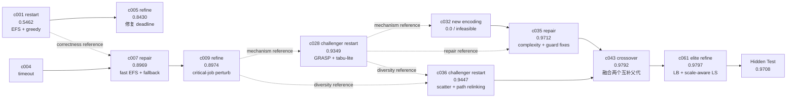

# Open Shop Scheduling：一条能体现 Harness 自进化能力的真实轨迹

> 来源：`all36-pi-deepseek-earlystop4-run1/tasks/23-open-shop-scheduling`
>
> 搜索预算：64 次 dev evaluation；实际完成 64 次
>
> 最终选择：`c061`；Dev `0.979701`；Hidden Test `0.970827`

## 为什么选这个案例

Open Shop Scheduling 是当前结果中最适合向 VP 展示“演化不是重复采样”的案例：

- 第一代最好候选只有 `0.546202`，最终提升到 `0.979701`，绝对提升 `+0.433499`，相对提升约 `79.4%`；
- 最终 hidden test 为 `0.970827`，与 dev 只差约 `0.0089`，没有靠异常 dev 分数取巧；
- 轨迹完整覆盖独立探索、Evaluator 反馈、Debug 定位、Repair、Diversity、Crossover 和 Elite Refine；
- 中间出现多个超时和代码缺陷，但 Archive 没有被失败覆盖，系统能够从失败分支中提取机制后继续演化；
- 最终候选不是简单复制某个父代，而是把不同分支中已经被 evaluator 验证的机制组合起来。

一句话讲法：

> 系统先把一个“只能得到 0.55 分的构造启发式”，逐步演化成“带 GRASP、Tabu、关键路径修复、Path Relinking、尺度自适应局部搜索和理论下界终止的 0.97 分求解器”。

## 结果轨迹

| 里程碑 | 代/评测 | Lane / Operator | Dev Score | 相对上一里程碑 | 发生了什么 |
|---|---:|---|---:|---:|---|
| `c001` | G0 / #1 | Independent / Restart | 0.546202 | — | 建立可行的 EFS 解码器和多种贪心排序，但时间边界写错，局部搜索实际上没有运行 |
| `c005` | G1 / #5 | Elite / Refine | 0.842983 | +0.296781 | Debug 发现 `deadline=9.5` 被错误当成绝对时间；改成 `t0 + limit`，首次真正启用局部搜索，并增加 critical-job perturbation |
| `c007` | G1 / #7 | Adaptive / Repair | 0.896893 | +0.053909 | 修复另一个超时分支，以 `c001` 为正确性参考，保留 O(n) EFS 和 always-feasible fallback，引入 swap/move 多邻域 |
| `c009` | G2 / #9 | Elite / Refine | 0.897380 | +0.000487 | 增加关键作业扰动、多启动、改进后再精修和更合理的时间预算分配 |
| `c028` | G6 / #28 | Challenger / Restart | 0.934914 | +0.037534 | 没有继续围绕 Elite 小修；挑战者注入全新 GRASP 动态优先级构造 + tabu-lite + critical repair 算法家族 |
| `c035` | G8 / #35 | Adaptive / Repair | 0.971235 | +0.036322 | `c032` 新编码失败后，Repair lane 参考 `c028` 的成功机制，修复复杂度和 deadline guard，形成高质量 GRASP 主干 |
| `c036` | G8 / #36 | Challenger / Restart | 0.944677 | 独立支线 | 产生另一条不同结构的 scatter search + path relinking + sideways acceptance 分支，为后续 crossover 提供互补能力 |
| `c043` | G10 / #43 | Adaptive / Crossover | 0.979203 | +0.007968 | 将 `c035` 的 GRASP/Tabu 高质量主干与 `c036` 的 population evolution/path relinking 融合，并加入 critical-op targeted relocation |
| `c061` | G15 / #61 | Elite / Refine | **0.979701** | +0.000498 | 加入理论 lower bound、尺度自适应 mild-worsen acceptance、更密的 deadline guard 和多位置关键操作 relocation |
| Final | Hidden Test | 单次终测 | **0.970827** | Dev/Test -0.008874 | 泛化保持稳定，证明该轨迹不是只适配 dev 的异常高分 |

## 候选谱系图



这张图最重要的信息不是“分数一直单调上涨”，而是：

- 系统允许候选失败；
- 失败不会覆盖已经验证的 Elite；
- Debug 和 memory 把失败转化为下一代的修复约束；
- 新算法家族由 Challenger 独立产生；
- Crossover 只在两个互补机制都得到 evaluator 验证后发生。

## 自进化具体发生在哪里

### 1. Evaluator 把模糊的“代码看起来不错”变成可执行反馈

`c001` 的代码声明自己有 local search，但 Debugger 结合代码和 dev 结果发现：

```python
t0 = time.time()
deadline = 9.5
...
while time.time() < deadline:
```

`time.time()` 是 Unix 时间戳，因此局部搜索条件永远为假。系统没有接受候选自己的文字总结，而是用 evaluator 分数和代码检查发现“算法模块存在但实际未执行”。

`c005` 将其修复为以 `t0` 为锚点的绝对截止时间，Dev 直接从 `0.5462` 提升到 `0.8430`。这是最直观的一次“反馈 → 修复 → 大幅提升”。

### 2. Repair lane 不只是修语法，而是修复杂度和可行性不变量

多个新分支尝试更复杂的 insertion/concurrent decoder，结果触发 200 秒超时或返回不完整排列。Retrospective memory 逐步沉淀出几个跨候选约束：

- 所有 expensive subroutine 必须在内部循环检查 deadline；
- fallback 必须通过 EFS 保证可行，不能返回 all-zero schedule；
- permutation helper 必须保持完整 cardinality；
- 大实例的核心构造应控制在 O(n²) 或更低；
- 使用保守的内部预算，并持续 early-commit 当前最佳可行解。

`c035` 的父候选 `c032` 是一次失败的全新编码，但 Repair lane 没有简单丢弃它，而是以 `c028` 为成功机制参考，将失败分支修复成 `0.9712`：

- 全排序改为 `heapq.nlargest` 的 partial top-K；
- list removal 改成 set-based O(1) removal；
- GRASP 构造内部加入 per-step deadline；
- 提前退出时补齐剩余操作，保持完整排列；
- 保留 serial-EFS 和 always-feasible fallback。

这体现了 Harness 的 Repair 是“基于可复用机制的结构修复”，而不是仅修编译错误。

### 3. Challenger lane 用独立算法家族打破局部最优

从 `c009` 的 `0.8974` 到 `c028` 的 `0.9349`，提升不是通过继续修改 Elite 得到的。`c028` 是 Challenger restart：读取历史失败教训，但从新的算法家族重新开始，构建了：

- dynamic-priority GRASP list scheduling；
- randomized top-K selection；
- tabu-lite local search；
- critical-job repair；
- conservative time budget 和 early commit。

这一步说明第四条并发分支不是简单增加采样数，而是在调度层明确承担“算法创新”职责。

### 4. Crossover 融合的是互补机制，不是复制两份代码

在 G8，系统同时保留：

- `c035 = 0.9712`：GRASP 构造质量高、速度稳定；
- `c036 = 0.9447`：单体分数略低，但带来 population evolution、path relinking 和允许平台/轻微退步的搜索能力。

`c043` 的 crossover 保留 `c035` 的 O(n·K) GRASP/EFS 主干，吸收 `c036` 的 scatter-search/path-relinking 和 sideways acceptance，再增加 critical-op targeted relocation，提升到 `0.9792`。

这正是系统设计中的核心：**质量最高的父代负责 exploitation，结构不同的父代提供 escape mechanism。**

### 5. Elite refine 在后期做小幅但可信的收敛

`c061` 没有再大改算法家族，而是针对 Debugger 发现的小实例局部最优问题做精修：

- 理论下界命中时提前终止；
- 小/大 makespan 使用不同的 mild-worsen slack；
- critical-op relocation 增加更多插入位置；
- path relinking 的 deadline 检查从每 16 步收紧到每 4 步。

分数只从 `0.979203` 提升到 `0.979701`，但最终 hidden test 仍有 `0.970827`。后期优化幅度变小，符合搜索接近收敛的正常形态。

## 一页 PPT 的推荐画法

页面标题：**从 0.55 到 0.97：Harness 如何把失败变成算法能力**

中间放一条横向轨迹：

```text
0.546  初始 EFS
   │ Debug：deadline 写错，局部搜索未执行
   ▼
0.843  修复时间锚点
   │ Repair：可行 fallback + 多邻域
   ▼
0.897  稳定 Elite
   │ Challenger：引入新 GRASP/Tabu 家族
   ▼
0.935  新算法突破
   │ Repair：复杂度、cardinality、deadline guard
   ▼
0.971  高质量主干 ───── 0.945 多样性支线
          │                  │
          └──── Crossover ───┘
                    ▼
                 0.979 Dev
                    ▼
                 0.971 Test
```

右侧只保留三条管理层结论：

1. **不是 Best-of-N：**分支有明确的 Elite、Repair、Challenger 和 Crossover 职责。
2. **失败也是资产：**超时、复杂度和可行性问题被压缩成跨代工程约束。
3. **结果可验证：**最终 hidden test 与 dev 接近，演化收益没有在终测中消失。

## 可审计原始轨迹

- [Archive：全部 64 个候选及父子关系](/home/jianghp3/cobench-runs/all36-pi-deepseek-earlystop4-run1/tasks/23-open-shop-scheduling/archive.json)
- [Retrospective memory：每代跨分支经验](/home/jianghp3/cobench-runs/all36-pi-deepseek-earlystop4-run1/tasks/23-open-shop-scheduling/retrospective_memory.md)
- [最终选择记录](/home/jianghp3/cobench-runs/all36-pi-deepseek-earlystop4-run1/tasks/23-open-shop-scheduling/final/selection.json)
- [Hidden test 结果](/home/jianghp3/cobench-runs/all36-pi-deepseek-earlystop4-run1/tasks/23-open-shop-scheduling/final/final_test_result.json)
- [c001 初始代码](/home/jianghp3/cobench-runs/all36-pi-deepseek-earlystop4-run1/tasks/23-open-shop-scheduling/candidates/c001/artifact/solution.py)
- [c005 deadline 修复代码](/home/jianghp3/cobench-runs/all36-pi-deepseek-earlystop4-run1/tasks/23-open-shop-scheduling/candidates/c005/artifact/solution.py)
- [c028 GRASP/Tabu 挑战者代码](/home/jianghp3/cobench-runs/all36-pi-deepseek-earlystop4-run1/tasks/23-open-shop-scheduling/candidates/c028/artifact/solution.py)
- [c035 Repair 后高质量主干](/home/jianghp3/cobench-runs/all36-pi-deepseek-earlystop4-run1/tasks/23-open-shop-scheduling/candidates/c035/artifact/solution.py)
- [c036 Path Relinking 多样性支线](/home/jianghp3/cobench-runs/all36-pi-deepseek-earlystop4-run1/tasks/23-open-shop-scheduling/candidates/c036/artifact/solution.py)
- [c043 Crossover 代码](/home/jianghp3/cobench-runs/all36-pi-deepseek-earlystop4-run1/tasks/23-open-shop-scheduling/candidates/c043/artifact/solution.py)
- [c061 最终代码](/home/jianghp3/cobench-runs/all36-pi-deepseek-earlystop4-run1/tasks/23-open-shop-scheduling/candidates/c061/artifact/solution.py)

## 口径说明

- 所有 Dev score、lane、operator、父候选和 reference 均来自 `archive.json`，不是根据代码事后编造的故事。
- 表格中的“上一里程碑”指全局 record-breaking 轨迹；`c036` 是为 crossover 保留的多样性支线，不是当时全局最高分。
- `c035` 的直接 parent 是失败候选 `c032`，`c028` 是 repair reference；这正是跨分支机制复用的真实行为。
- 最终测试只在候选选择后运行一次，没有进入演化反馈。
