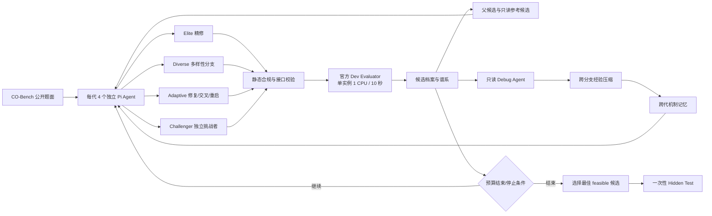

# Pi + DeepSeek CO-Bench：从大模型生成到可审计的算法演化系统

> VP 汇报底稿 / PPT 内容母版
>
> 项目：`self-harness`，分支：`experiment/pi-cobench`，基线提交：`386a42e`
>
> 数据快照：`all36-pi-deepseek-earlystop4-run1`，截至 2026 年 8 月 15 日
>
> 文档日期：2026 年 8 月 19 日

## Executive Summary

- **核心资产不是基础模型，而是模型外部的算法演化 Harness。** 系统冻结 DeepSeek 权重，让多个 Pi Agent 在候选程序空间中独立探索，再用官方 CO-Bench evaluator 作为唯一裁判，完成“生成—评测—诊断—选择—变异—复测”的闭环。模型可以替换，真正可积累的是搜索策略、候选谱系、反馈记忆、评测隔离和批量运行能力。

- **首轮已经验证了端到端可行性，但当前 0.7333 仍是工程受损的实验分，而不是严格可比的最终能力分。** 36 题全部完成调度；30 题获得 hidden test，按这 30 题计算均分为 0.8809，但正确的 36 题总分是 0.7341，按论文口径将单题分数截断到 1 后为 0.7333。该结果低于 Classical Solver 的 0.797 和 FunSearch 的 0.842。

- **主要损失来自 Harness 控制面，而不是已证实的模型能力上限。** 6 个零分题的 384 个候选槽位中，377 个被记录为 evaluator exception；日志显示外层 dev watchdog 在 200 秒杀死了需要遍历多个实例的官方 evaluator。另有 `Exception` 未被纳入不可行判定，导致 Aircraft landing 等候选被错误视为 feasible，并可能触发 `dev >= 1` 提前停止。

- **下一阶段首先要建立可信基线，再讨论算法上限。** 修复外层 watchdog、错误识别和批任务状态机；先独立重跑 6 个零分题，再关闭 early stop、统一 64 次评测，完成全新 36 题复验。只有这一轮才能与 0.797/0.842 做正式对比，并支持后续模型、搜索策略和成本效率的消融分析。

## 一句话定位

这是一个**面向组合优化的、多智能体程序搜索与演化平台**：它不训练 DeepSeek，而是让 DeepSeek 持续提出可执行求解器，用官方 evaluator 的客观反馈驱动选择和演化，最终交付经过 hidden test 的算法代码。

对管理层而言，可把它理解为：

> 把一次性的“让大模型写算法”，升级为有预算、有竞争、有记忆、有审计、有安全边界的自动化算法研发流水线。

## 端到端框架

系统有两层并发，但把正式评测资源限制在可比范围内：

| 层级 | 并发设计 | 作用 |
|---|---:|---|
| 单题内部 | 4 个候选 Agent 并发生成；`evaluation_workers=1` | 扩大算法多样性，同时让该题的候选按顺序进入 evaluator |
| 36 题批处理 | 4 道题并发 | 提升墙钟吞吐，不改变单个候选的 `cpu_num=1`、`timeout=10s` |

## 核心技术一：在“程序空间”演化，而不是修改模型权重

传统一次性 prompting 的结果高度依赖单次采样；本项目把每个 `solution.py` 当成可评测、可继承、可变异的个体。每个候选都记录：

- 父候选和跨分支参考关系；
- 生成算子、分支类型和设计理由；
- 静态校验、dev score、可行性、运行时间和错误类型；
- Debug 报告、算法机制标签、代码指纹；
- 在 64 次正式评测预算中的位置。

这使系统优化的对象从“模型回答文本”变成“可执行算法及其谱系”。基础模型提供生成能力，Harness 负责把生成能力转化为可重复的搜索过程。

**技术意义：**模型升级可以直接替换生成后端，而候选档案、演化策略、评测协议和历史经验继续复用；资产沉淀不被绑定在某个模型版本上。

## 核心技术二：质量与多样性共同驱动的四路搜索

每一代不是简单做四次 Best-of-N，而是为四个分支分配不同搜索职责：

| 分支 | 主要算子 | 解决的问题 |
|---|---|---|
| Elite | `refine` | 利用当前最高分 feasible 候选，持续做局部增强 |
| Diverse | `refine-diverse` | 保留与 Elite 结构差异较大的高质量算法，避免种群塌缩 |
| Adaptive | `repair` / `crossover` / `restart` / `refine` | 根据不可行率、停滞、搜索阶段动态切换探索方式 |
| Challenger | `restart` 或后期 `refine-diverse` | 为额外并发保留独立算法家族，扩大跳出局部最优的概率 |

多样性不是靠提示词口号维持。Archive 会对候选代码进行 token shingling，并用 Jaccard 相似度估计结构相似性；Diverse 分支按“归一化质量 + 多样性权重 × 新颖度”选择父候选。

当近期无提升时，调度器注入新算法家族；当不可行率升高时，优先修复失败分支；进入后期后，预算逐步转向精修。CO-Bench 专用调度器还在搜索早期强制保留 immigrant/restart 通道。

**技术意义：**这不是四个 Agent 重复答题，而是一个显式管理 exploration、exploitation、repair 和 diversity 的搜索拓扑。

## 核心技术三：把 evaluator 反馈转化为跨代学习

系统有三类互相隔离的 Agent 角色：

1. **Producer** 只在自己的候选目录写代码，并读取被允许的题面、父候选、参考候选和机制记忆。
2. **Debugger** 在评测后只读分析接口错误、约束违反、复杂度瓶颈和算法弱点，提出最小高价值变异。
3. **Communicator** 每隔若干代或在停滞/高不可行率时，把多个分支的结果压缩为机制级经验。

同一代候选互相不可见，只有完成正式评测后才交流结果，降低“过早抄同一条思路”造成的分支塌缩。共享内容聚焦增量更新、邻域设计、构造顺序、修复算子、fallback 等可迁移机制，不共享 hidden test，也不把自然语言判断置于 evaluator 分数之上。

**技术意义：**它实现的是无需更新模型参数的“外部学习”：有效经验通过候选谱系和 retrospective memory 跨代积累。

## 核心技术四：防泄漏、资源公平与最小权限执行

系统把评测边界设计成一等能力：

- 搜索阶段只构造官方 `get_dev()` 指定的公开开发集视图；
- `evaluate()` 拒绝返回任何 `test*` 字段；
- 只在候选选择完成后执行一次 final hidden test，并复用已持久化结果，避免重复探测测试集；
- AST 静态检查要求同步顶层 `solve`，并拦截常见文件、进程、动态代码和网络访问；
- Pi 运行时通过可见性扩展限制每个角色的读写根目录，Producer 不能修改父分支，Debugger/Communicator 只读；
- Docker evaluator 能以无网络、只读根文件系统、只读代码/数据挂载、1 CPU 和受限内存运行。

需要如实说明：**本次 all-36 实验的生成配置使用了 `execution_backend: local`，并非 Docker。** 因此当前结果验证了 dev/test 数据切分、静态策略和 CPU/超时参数，但还不能宣称该轮已完成容器级隔离验证。严格官方复验应启用 Docker，或明确说明采用 local 的可比性与风险。

**技术意义：**只有把信息边界、计算预算和最终测试访问制度化，自动算法搜索的成绩才可复现、可审计、可对外比较。

## 核心技术五：可恢复、可追踪的长周期实验控制面

一次 36 题 × 64 候选的实验最多包含 2,304 次正式 dev 评测和大量模型调用，工程上不能依赖单个长进程“跑到底”。当前控制面已具备：

- 每题独立输出目录和配置；
- `archive.json` 持久化候选图，完成的候选不覆盖；
- 原子更新 `summary.json`，支持批任务断点续跑；
- 运行 manifest 拒绝用不同题目或 evaluator 配置误续跑；
- 已存在的 final test 结果直接复用；
- 每个 Producer、Debugger、Communicator 会话单独保存 Pi events、stderr 和清洗后 trace；
- 任务级与候选级并发分别受控。

这部分不是辅助脚本，而是平台能否规模化使用的关键。首轮暴露的问题也说明：当 Agent 能力提高后，状态机、超时层级和结果语义会成为新的系统瓶颈。

## 首轮结果：高分覆盖已经出现，但总分被六个系统性零分显著拉低

### 统一口径

| 指标 | 结果 | 正确解释 |
|---|---:|---|
| 调度完成 | 36 / 36 | 所有官方任务均进入批处理并产生任务记录 |
| 获得 hidden test | 30 / 36 | 6 题没有 selection/final test，应按 0 计入总分 |
| 30 个有分题均分 | 0.880862 | 仅用于观察已有结果质量，**不能作为官方总分** |
| 36 题 Avg Score | 0.734052 | 缺失题按 0 计算 |
| Paper-capped Avg Score | 0.733294 | 单题分数超过 1 时截断为 1 |
| Valid Solution | 25 / 36 = 0.6944 | 30 个有分题中，5 题的 hidden feedback 仍含 Exception/Timeout/No result 类无效实例 |
| 实际 dev 评测数 | 1,720 / 2,304 | 25 题跑满 64 次，11 题少于 64 次 |

### 与公开基线比较

| 方法 | Avg Score | 与本轮 paper-capped 的差值 | 当前可比性 |
|---|---:|---:|---|
| FunSearch | 0.842 | -0.109 | 本轮尚未严格统一预算，不能下最终结论 |
| Classical Solver | 0.797 | -0.064 | 本轮尚未严格统一预算，不能下最终结论 |
| Pi + DeepSeek Harness（本轮） | **0.733** | — | 6 个 Harness 零分、11 题提前停止；属预验证结果 |

从分布看，36 题中有 20 题 test score 不低于 0.90，17 题不低于 0.95，12 题不低于 0.99。这说明系统不是“少数题偶然成功”；但 6 个系统性零分足以把 30 题均分 0.8809 拉低到全量 0.7341。

**管理层应采用的表述：**首轮证明了自动演化 Harness 能在多数题上产出高质量求解器，但尚未完成公平、无控制面缺陷的全量基线验证。

## 当前瓶颈首先在 Harness，而非生成模型

### 1. 外层 200 秒 watchdog 错杀完整 dev evaluator

官方限制是**单实例** 10 秒、1 CPU；一道题的 dev split 可能包含许多实例，因此 evaluator 整体运行时间可以显著超过 200 秒。当前 Adapter 却把整个 dev subprocess 的 watchdog 设为 `max(60, timeout_seconds × 20)`，在本轮即 200 秒。

受影响的 6 题为：

- Constrained non-guillotine cutting
- Container loading
- Container loading with weight restrictions
- Hybrid Reentrant Shop Scheduling
- Multi-Demand Multidimensional Knapsack problem
- Travelling salesman problem

这 6 题合计 384 个候选槽位，其中 377 个为 `evaluator_exception`，仅 7 个是本地静态校验失败。也就是说，零分主要反映 evaluator 进程被外层杀死，而不是 64 个候选都被官方评测认定为算法不可行。

### 2. `Exception` 识别不完整，污染 feasible 与 early stop

Worker 的 `_error_type()` 已能识别 `exception`，但计算 `error_lines` 时只统计 `Caught Error`、`Timeout` 和 `No result`，没有统计 `Exception:`。因此可能出现语义冲突：

- `error_type = "exception"`；
- 但 `feasible = true`；
- 极端 dev score 仍参与选优；
- 当启用 `target_score=1.0` 时触发错误提前停止。

Aircraft landing 是直接证据：被选择候选 dev score 为 14.7117、`feasible=true`，同时 dev feedback 明确包含 separation violation 的 `Exception`；最终 test 仅 0.4501，且仍含无效实例。

### 3. “进程成功”被误当成“任务成功”

当 64 个候选都不可行时，单题进程会正常返回 `best=None, final_test=None`，return code 仍为 0。批处理当前只根据 return code 标记 `complete`，导致 6 个无结果任务被永久跳过，断点续跑无法自动重试。

正确状态应是 `no_feasible` 或 `failed`，并且只有存在 selection 以及配置要求时存在 final test，才能标记 `complete`。

### 4. 提前停止口径不适合本轮官方比较

11 题没有跑满 64 次，其中 Aircraft landing 和 Euclidean Steiner problem 的 dev score 明显异常。CO-Bench 单题归一化分数并不都天然以 1 为严格上界；Euclidean Steiner 的公开归一化配置使用“候选 improvement / 极小 optimal improvement”，可产生远大于 1 的 dev outlier。

因此，`dev >= 1` 不是全题通用的最优性证明。对外基线应关闭 early stop，所有题统一跑满 64 次；超过 1 的分数只在最终论文汇总时按规定截断，不能反过来作为提前停止条件。

## 结果告诉我们的真正技术判断

### 已经得到验证

- 4 路候选生成、单题串行正式评测、4 题并发的双层调度可以运行完整 36 题集。
- 候选谱系、评测结果、Debug、机制记忆和 final test 均能持久化，失败后可以从 archive 继续。
- 30 题获得 hidden test，且其中 20 题达到 0.90 以上，证明大模型驱动的程序搜索对多类组合优化问题具有广泛有效性。
- dev/test 分离路径在代码结构上明确，final test 不进入演化反馈。

### 尚未得到验证

- 修复控制面后，6 个零分题能恢复多少分。
- 全部 36 题严格 64 次后，最终 Avg Score 是否超过 Classical Solver 或接近 FunSearch。
- 四路演化相对于 64 次独立采样、Best-of-N 或单一 Elite refine 的净增益。
- retrospective memory、Debugger、代码多样性选择各自贡献多少。
- 在完全 Docker 隔离条件下，分数、成功率和运行成本是否保持一致。

### 不应对 VP 过度承诺

- 当前不能宣称“超过 Classical Solver”或“达到 FunSearch 水平”。
- 不能用 30 题均分 0.8809 作为项目总分。
- 不能把 6 个零分简单归因于 DeepSeek，也不能在修复重跑前假设它们一定能全部恢复。
- 不能把 11 题提前停止后的结果与统一 64 次预算的论文结果视为严格同口径。

## 技术壁垒与可产品化资产

| 层次 | 可沉淀资产 | 为什么有壁垒 |
|---|---|---|
| 搜索策略 | 多分支拓扑、阶段调度、repair/crossover/restart 策略 | 需要大量真实评测才能形成稳定策略，不是换一个 prompt 就能复制 |
| 反馈学习 | Debug 结构化诊断、机制级记忆、跨分支经验治理 | 决定系统能否从失败中积累，而不是重复采样 |
| 评测治理 | dev/test 隔离、可行性语义、资源预算、一次性 final test | 决定结果是否可信并能对外比较 |
| 实验控制面 | 候选图、断点恢复、原子状态、任务隔离、审计 trace | 支撑数千次评测的稳定运行和问题追责 |
| Adapter 层 | evaluator-agnostic 接口与 CO-Bench 专用适配 | 允许从 benchmark 扩展到企业内部排产、装载、选址、路径等求解任务 |

模型本身不是唯一壁垒。更有长期价值的是把“任何可调用模型 + 任何可量化 evaluator”接成一个稳定的算法研发系统。

## 建议的下一阶段与验收门槛

### P0：先修复可信度问题

1. 将 dev subprocess 外层 watchdog 放宽到能覆盖完整官方 evaluator，同时保持单实例 `timeout=10s`、`cpu_num=1`。
2. 将 `Exception`、`Caught Error`、`Timeout`、`No result` 统一映射为 `feasible=false`。
3. 将批处理完成条件改为“return code 成功且存在有效 selection/final test”；`no_feasible` 可断点重试。
4. 为三类问题补回归测试：长总时长、多实例异常、无 feasible 的批任务状态。

### P1：用最小成本确认修复有效

使用新输出目录重跑 6 个零分题，不覆盖旧结果。验收点不是“分数必须高”，而是：

- dev evaluator 不再在固定 200 秒退出；
- 能产生真实 dev feedback；
- 异常候选不会被标记 feasible；
- 有 feasible 候选时生成 selection 和 final test；
- 无 feasible 时状态明确且可再次续跑。

### P2：建立可对外的严格全量基线

关闭 early stop，36 题全部统一：

- `evaluation_budget=64`
- `branches=4`
- `generation_workers=4`
- `evaluation_workers=1`
- task workers = 4
- evaluator `cpu_num=1`
- evaluator `timeout_seconds=10`
- `run_final_test=true`

对外只报告 36 题缺失按 0 的 Avg Score、paper-capped Avg Score、Valid Solution 和每题评测次数。

### P3：证明“演化”本身的增益

在可信基线之后做等预算消融：

- 64 次独立采样 vs. 四路演化；
- 无 Diverse lane；
- 无 Debugger；
- 无 retrospective memory；
- 三路 vs. 四路；
- local vs. Docker；
- DeepSeek vs. 另一基础模型。

建议最终回答三个经营问题：每提升 0.01 Avg Score 需要多少模型调用与墙钟时间；成功率提升来自模型还是 Harness；该框架迁移到内部优化任务需要多少 Adapter 工作量。

## VP 汇报建议：10 页 PPT 故事线

### 第 1 页：结论页——我们做的不是“模型写代码”，而是“自动演化算法”

- 一句话定位；
- 0.7333 当前全量分；
- 6 个 Harness 零分；
- 结论：方向已验证，正式基线尚待修复重跑。

### 第 2 页：为什么需要 Harness

- 单次生成不稳定、不可积累、不可审计；
- 组合优化有明确 evaluator，适合程序搜索；
- Frozen model + executable feedback loop 的价值。

### 第 3 页：系统全景图

- 使用本文“端到端框架”图；
- 强调 4 路候选、官方 dev evaluator、候选图、hidden test 隔离。

### 第 4 页：四路演化如何避免同质化

- Elite / Diverse / Adaptive / Challenger；
- refine / repair / crossover / restart；
- 质量与代码结构多样性双目标。

### 第 5 页：如何从失败中学习

- Producer、Debugger、Communicator 三角色；
- 同代隔离、评测后交流；
- 机制级记忆而不是复制代码。

### 第 6 页：如何保证结果可信

- dev/test 隔离；
- 1 CPU / 10 秒；
- AST 校验、最小权限、Docker 能力；
- Archive、断点恢复和审计 trace。

### 第 7 页：首轮结果

- 36/36 调度，30/36 有 hidden test；
- 0.8809 是有分题均值，正式全量是 0.7341 / capped 0.7333；
- 20 题 ≥ 0.90，展示“广度已有、尾部拖累”的结论。

### 第 8 页：为什么现在不能直接与论文排名下结论

- 6 题被 200 秒外层 watchdog 系统性杀死；
- 11 题未统一跑满 64 次；
- Exception 判定和异常 early stop；
- 本轮 local backend。

### 第 9 页：核心壁垒与复用价值

- 搜索拓扑；
- 反馈学习；
- 评测治理；
- 长周期控制面；
- 可迁移 Adapter。

### 第 10 页：下一步和资源请求

- P0 修复 → 6 题验证 → 全新 36 题严格复验 → 消融；
- 里程碑以“可信基线、可复现、可迁移”定义；
- 需要的算力/模型预算在修复后用严格跑的真实消耗测算。

## 进一步需要回答的问题

- 6 个长 evaluator 任务的真实 dev 总时长分布是多少，3660 秒 watchdog 是否足够且不过度？
- 哪些题的 normalized score 理论上有 1.0 上界，是否应建立 task-specific early-stop policy？
- Valid Solution 的官方统计脚本和本报告的日志估算是否完全一致？
- 本轮使用 local evaluator 的原因是什么，严格复验是否切回 Docker？
- 候选生成、Debug、Communication 各自的 token、费用和墙钟占比是多少？
- 30 个有分题上，dev best 与 hidden test 的相关性和过拟合程度如何？
- 迁移到内部真实优化任务时，是否已有可用的 evaluator、历史基线和可接受的求解时限？

## 附录 A：36 题逐题结果

“有分但含无效实例”表示 final test feedback 中出现 `Exception`、`Caught Error`、`Timeout` 或 `No result`；这是当前 Valid Solution 25/36 的日志估算口径。

| 题目 | 评测次数 | Dev best | Hidden test | 结果状态 |
|---|---:|---:|---:|---|
| Aircraft landing | 4 | 14.7117 | 0.4501 | 有分但含无效实例 |
| Assignment problem | 8 | 1.0000 | 1.0000 | 有效 |
| Assortment problem | 64 | 0.8700 | 0.4263 | 有效 |
| Bin packing - one-dimensional | 64 | 0.9759 | 0.9768 | 有效 |
| Capacitated warehouse location | 64 | 0.7323 | 0.7424 | 有效 |
| Common due date scheduling | 12 | 1.0175 | 0.9721 | 有效 |
| Constrained guillotine cutting | 64 | 0.9959 | 0.9959 | 有效 |
| Constrained non-guillotine cutting | 64 | — | 0.0000 | 无结果（按 0） |
| Container loading | 64 | — | 0.0000 | 无结果（按 0） |
| Container loading with weight restrictions | 64 | — | 0.0000 | 无结果（按 0） |
| Corporate structuring | 8 | 1.0000 | 0.9975 | 有效 |
| Crew scheduling | 64 | 0.6864 | 0.7347 | 有分但含无效实例 |
| Equitable partitioning problem | 4 | 1.0000 | 1.0000 | 有效 |
| Euclidean Steiner problem | 8 | 584.7927 | 0.2627 | 有分但含无效实例 |
| Flow shop scheduling | 64 | 0.9442 | 0.9421 | 有效 |
| Generalised assignment problem | 8 | 1.0623 | 0.9948 | 有效 |
| Graph colouring | 64 | 0.9453 | 0.9270 | 有效 |
| Hybrid Reentrant Shop Scheduling | 64 | — | 0.0000 | 无结果（按 0） |
| Job shop scheduling | 64 | 0.8060 | 0.7942 | 有效 |
| Maximal independent set | 64 | 0.8874 | 0.8866 | 有效 |
| Multi-Demand Multidimensional Knapsack problem | 64 | — | 0.0000 | 无结果（按 0） |
| Multidimensional knapsack problem | 4 | 2.1844 | 0.9946 | 有效 |
| Open shop scheduling | 64 | 0.9797 | 0.9708 | 有效 |
| Packing unequal circles | 28 | 1.0000 | 1.0000 | 有效 |
| Packing unequal circles area | 4 | 1.0114 | 1.0114 | 有效 |
| Packing unequal rectangles and squares | 64 | 0.9814 | 0.9814 | 有效 |
| Packing unequal rectangles and squares area | 32 | 1.0159 | 1.0159 | 有效 |
| Resource constrained shortest path | 64 | 0.8446 | 0.7509 | 有分但含无效实例 |
| Set covering | 64 | 0.8581 | 0.8709 | 有效 |
| Set partitioning | 64 | 0.8243 | 0.8192 | 有分但含无效实例 |
| Travelling salesman problem | 64 | — | 0.0000 | 无结果（按 0） |
| Uncapacitated warehouse location | 64 | 1.0000 | 0.9997 | 有效 |
| Unconstrained guillotine cutting | 64 | 0.9580 | 0.9813 | 有效 |
| Vehicle routing: period routing | 64 | 0.9173 | 0.9328 | 有效 |
| p-median - capacitated | 64 | 0.9979 | 0.9953 | 有效 |
| p-median - uncapacitated | 64 | 0.9994 | 0.9987 | 有效 |

## 附录 B：事实来源与口径

- 实验汇总：`/home/jianghp3/cobench-runs/all36-pi-deepseek-earlystop4-run1/summary.json`
- 批跑日志：`/home/jianghp3/cobench-runs/all36-pi-deepseek-earlystop4-run1/supervisor.log`
- 单题配置：`/home/jianghp3/cobench-runs/all36-pi-deepseek-earlystop4-run1/configs/`
- 候选 archive：`/home/jianghp3/cobench-runs/all36-pi-deepseek-earlystop4-run1/tasks/*/archive.json`
- 通用演化引擎：[engine.py](../evolution/engine.py)、[scheduler.py](../evolution/scheduler.py)、[archive.py](../evolution/archive.py)
- CO-Bench 专用调度与终测：[cobench.py](../evolution/cobench.py)
- evaluator 隔离与 watchdog：[adapters/cobench.py](../evolution/adapters/cobench.py)
- dev/test 数据视图与反馈解析：[cobench_worker.py](../evolution/adapters/cobench_worker.py)
- 批任务状态机：[cobench_batch.py](../evolution/cobench_batch.py)
- Pi 角色与工具权限：[pi_agents.py](../evolution/pi_agents.py)、[pi_runtime.py](../agents/pi_runtime.py)、[visibility_guard.ts](../agents/pi_extensions/visibility_guard.ts)
- Classical Solver 0.797、FunSearch 0.842：来自本次项目交接提供的论文比较口径；正式对外材料应补充论文页码或官方表格链接。

### 计算口径

- `Avg Score = sum(36 个 hidden test score，缺失记 0) / 36`
- `Paper-capped Avg Score = sum(min(task_score, 1.0)) / 36`
- `Valid Solution = 不含异常实例的最终有效任务数 / 36`；本轮为日志估算，待与官方统计脚本复核。
- 30 题均分只在非缺失题上计算，不用于排行榜或正式对比。

### 关键假设与限制

- 本文只分析现有实现和首轮产物，没有修改 Harness，也没有启动新实验。
- 6 个零分题的主因由 archive 中的 `evaluator_exception` 和 200 秒 TimeoutExpired 直接支持；修复后能恢复到多少分仍需实测。
- `Exception` 漏判能直接解释 Aircraft landing 的错误 feasible/early stop；Euclidean Steiner 的极端 dev score 还涉及官方归一化对极小分母的放大，不能只归因于异常文本漏判。
- 本轮 11 题少于 64 次，因此任何与统一 64 次基线的比较都属于方向性参考。
